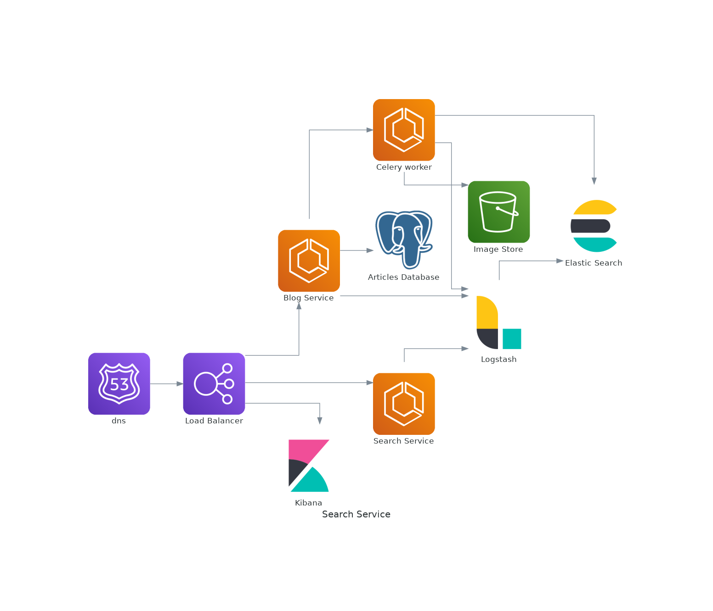

# Search Service

> An application cosisting of two microservices: one for registering authors and enabling them to create articles and the other for searching for articles.   

<p align="center">
  
  
  
  
  
  
  
  
  
  
  
  
  
  
  
</p>



## Project Overview
This application consists of two microservices:
1. Blog Service
2. Search Service

### Blog Service
This is a web application that enables an author to register to create, view, update and delete blog posts. Other functionalities include:
1. Commenting on posts
2. Liking posts
3. Bookmarking posts
4. Reporting posts
5. Stats for a given post and author.

The application uses Postgres to store author data, AWS S3 to store images and sends its logs to Elasticsearch through logstash. The application uses a celery worker to upload the images to S3 as well as to send documents to the elastic search cluster.

### Search Service
This is a web application that enables an author to search for artciles. It is driven by elastic search. The searches available include:
1. Searching through the authors own articles
2. Searching through all the published articles
3. Searching through articles published by the authors followers or those that the author follows
4. Searching through the articles that the author has liked, bookmarked, read or commented on.
5. Searching through articles with given tags.

The application allows for full text searches.

## Working 

It's pretty easy to use the application. On the home page (http://localhost:5000/apidocs):

 1. Create an account (post details through register route)
 2. Log in with the createdcredentials to receive an authorization token.
 3. Use that token to authorize yourself.
 4. You can then access the apps functionality(create, delete, update articles and details)
 5. Access the search service (http://localhost:5001/apidocs) to search for particular articles.
 6. Access (http://localhost:5000/logs) to view the application logs

## Local Setup

Here is how to set up the application locally:

  1. Clone the application repo:</br>

      ```sh
      git clone https://github.com/twyle/Medium-Clone-Blog-Service.git
      ```

  2. Navigate into the cloned repo:

      ```sh
      cd Medium-Clone-Blog-Service
      ```

  3. Start the elk cluster:

      ```sh
      make run-elk
      ```

  4. Create the environment variables for services:
    Blog Service

      ```sh
      touch ./services/blog/.env
      ```

      Then paste the following into the file:

      ```sh

        FLASK_DEBUG=True
        FLASK_ENV=development
        FLASK_APP=manage.py

        SECRET_KEY=secret-key

        POSTGRES_HOST=localhost
        POSTGRES_USER=lyle
        POSTGRES_PASSWORD=lyle
        POSTGRES_DB=lyle
        POSTGRES_PORT=5432

        S3_BUCKET=<s3-bucket-name>
        AWS_ACCESS_KEY=<aws-access-key>
        AWS_ACCESS_SECRET=<aws-secret-key>

      ```
    Search Service

      ```sh
      touch ./services/blog/.env
      ```

      Then paste the following into the file:

      ```sh

        FLASK_DEBUG=True
        FLASK_ENV=development
        FLASK_APP=manage.py

        SECRET_KEY=secret-key

        POSTGRES_HOST=localhost
        POSTGRES_USER=lyle
        POSTGRES_PASSWORD=lyle
        POSTGRES_DB=lyle
        POSTGRES_PORT=5432

      ```

      Then create the database secrets:

      ```sh
      cd services/database
      touch .env
      ```

      Then paste the following into the file:

      ```sh
        POSTGRES_DB=lyle
        POSTGRES_PORT=5432
        POSTGRES_USER=postgres
        POSTGRES_PASSWORD=lyle
      ```

  5. Start the application:

      ```sh
      docker-compose -f docker-compose-dev.yml up --build -d
      ```

  6. View the running application

      Head over to http://0.0.0.0:5000/apidocs and http://0.0.0.0:5001/apidocs

 <p align=center>
  
</p>

## Development

 #### 1. Application Design

  1. **Services**

      The application consists of two services.

      1. Blog Service 
        
        This services enables the creation, update, deletion and viewing of articles. The routes include:

        | Route                   | Method  | Description                 |
        | ------------------------| ------- |---------------------------- |
        | 'api/v1/author'           | DELETE  | Delete a author.              |
        | 'api/v1/author'           | PUT     | Update author info.           |
        | 'api/v1/author'           | GET     | Get a author's info.          |
        | 'api/v1/authors'          | GET     | List all authors.             |
        | 'api/v1/author/articles_published'           | GET     | Get all articles published by this author.         |
        | 'api/v1/author/articles_read'           | GET     | Get all articles read by this author.         |
        | 'api/v1/author/bookmarks'           | GET     | Get all articles bookmarked by this author.         |
        | 'api/v1/author/comments'           | GET     | Get all comments written by this author.         |
        | 'api/v1/author/likes'           | GET     | Get all likes by this author.         |
        | 'api/v1/author/stats'           | GET     | Get this authors stats.         |
        | 'api/v1/article'           | DELETE  | Delete a article.              |
        | 'api/v1/article'           | PUT     | Update article info.           |
        | 'api/v1/article'           | GET     | Get a article's info.          |
        | 'api/v1/articles'          | GET     | List all articles.             |
        | 'api/v1/article/articles_views'           | GET     | Get the views for this article.         |
        | 'api/v1/article/bookmark'           | GET     | Bookmark this article.         |
        | 'api/v1/article/bookmarks'           | GET     | Get this articles bookmarks.         |
        | 'api/v1/article/comment'           | POST     | Comment on this article.         |
        | 'api/v1/aarticle/comments'           | GET     | Get all comments on this article.         |
        | 'api/v1/article/like'           | GET     | Like this article.         |
        | 'api/v1/article/likes'           | GET     | Get all of this articles likes.         |
        | 'api/v1/article/report'           | POST     | Report this article.         |
        | 'api/v1/article/stats'           | GET     | Get this articles stats.         |
        | 'api/v1/article/tag'           | GET     | Tag this article.         |
        | 'api/v1/article/tags'           | GET     | Get this article's tags.         |
        | 'api/v1/article/unbookmark'           | GET     | Unbookmark this article.         |
        | 'api/v1/article/uncomment'           | POST     | Delete a comment on this article.         |
        | 'api/v1/article/unlike'           | GET     | Unlike this article.         |
        | 'api/v1/article/untag'           | GET     | Untag this article.         |

        This service uses Postgres to store the user info, AWS S3 to store the images, AWS SES to send the emails and celery for the email sending and photo upload.

      2. Blog Service 
        
        This services enables the user to search for articles:

        | Route                   | Method  | Description                 |
        | ------------------------| ------- |---------------------------- |
        | 'api/v1/search/search'           | POST  | Search for a given article in your own articles.|
        | 'api/v1/search/search_all_articles'           | POST  | Search for a given article in all the articles.|
        | 'api/v1/search/search_articles_author_followers'           | POST  | Search for a given article in articles written by authors who follow you.|
        | 'api/v1/search/search_articles_author_follows'           | POST  | Search for a given article in articles written by authors you follow.|
        | 'api/v1/search/search_articles_bookmarked'           | POST  | Search for a given article in articles that you've bookmarked.|
        | 'api/v1/search/search_articles_commented'           | POST  | Search for a given article in articles that you've commented on.|
        | 'api/v1/search/search_articles_liked'           | POST  | Search for a given article in articles that you've liked.|
        | 'api/v1/search/search_articles_read'           | POST  | Search for a given article in articles that you've read.|
        | 'api/v1//search/search_articles_with_tags'           | POST  | Search for a given article in articles with given tags.|

  2. **Database**

      The application uses Postgres and AWS S3. The postgres database is used to store user details. The AWS S3 bucket is used to store the profile pictures.

  3. **Security**

      The application uses JSON Web Tokens to authorize access to protected routes. The passwords are also encrypted.

## Deployment

  ## Contribution

1. Fork it https://github.com/twyle/repo-template/fork
2. Create your feature branch (`git checkout -b feature/fooBar`)
3. Commit your changes (`git commit -am 'Add some fooBar'`)
4. Push to the branch (`git push origin feature/fooBar`)
5. Create a new Pull Request

## Developer

Lyle Okoth – [@lylethedesigner](https://twitter.com/lylethedesigner) on twitter </br>

[lyle okoth](https://medium.com/@lyle-okoth) on medium </br>

My email is lyceokoth@gmail.com </br>

Here is my [GitHub Profile](https://github.com/twyle/)

You can also find me on [LinkedIN](https://www.linkedin.com/in/lyle-okoth/)

## License

Distributed under the MIT license. See ``LICENSE`` for more information.
